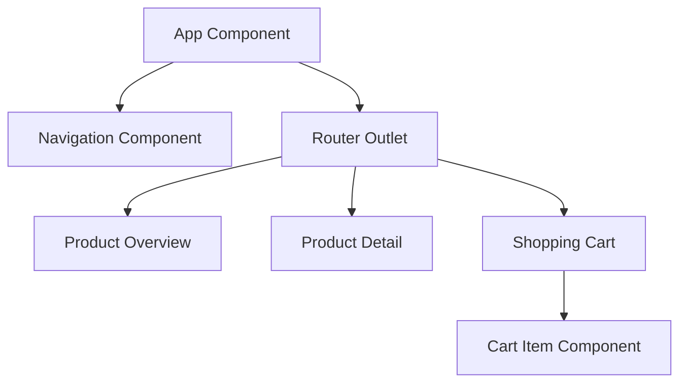
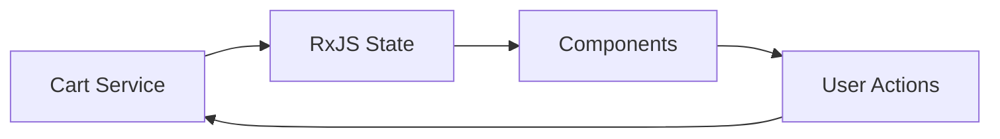

# System Patterns: Angular Webshop

## Architecture Overview

### Component Structure

### State Management

## Design Patterns

### Data Service Pattern
- Shopping cart service manages cart state using BehaviorSubject
- Cart operations (add, remove, update) in service
- Total price calculation handled in service
- Real-time cart item count for badge display
- Single source of truth for cart state

### Component Communication
- Parent-child communication via @Input/@Output
- Service-based state management
- RxJS Observables for state updates
- Cart state shared across components

### API Integration
- HTTP service for product fetching
- Product interface matching API schema
- Error handling middleware
- Response type enforcement

## Component Relationships

### Product Overview
- Displays product grid
- Implements category filtering
- Links to product details
- Subscribes to product service

### Product Detail
- Shows single product
- Handles add to cart
- Manages product loading state
- Communicates with cart service

### Shopping Cart
- Displays cart contents
- Updates cart state
- Shows total price
- Uses CartItem component for item display
- Material Design components
- Responsive layout

### Cart Item
- Standalone component for cart items
- Manages individual item display and actions
- Input: cart item data
- Outputs: quantity changes and item removal
- Uses getter pattern for computed values (e.g., total price)
- Encapsulated styles and logic
- Material Design integration

## CSS Styling Patterns

### Selector Usage
- Use class selectors over element selectors for better specificity control
- Prefix class names with component context when needed
- Example: `.cart-item` instead of `.item`

### Layout Structure
- Content areas use semantic class names
- Toolbar positioning uses sticky positioning
- Consistent spacing using padding/margin
- Responsive design with media queries

### Component Modularity
- Each component has its own style file
- Scoped styles with component prefix
- Shared styles in global stylesheet
- Material Design theming